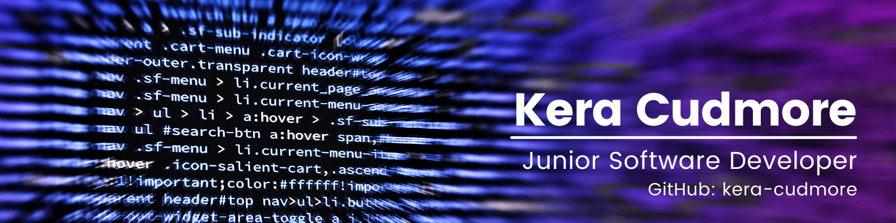

# KERA CUDMORE
## Junior Software Developer

### About Me

Hi there I'm Kera, and I'm currently enrolled on a Level 5 Diploma in Web Application Development with the Code Instutite to become a Full Stack Developer. I always loved solving puzzles, and figuring out how the puzzle was created in the first place, so learning to code has provided me with never ending puzzles to solve and I'm loving every minute!

When I'm not coding, I can be found doing one of my many other hobbies such as reading 📚 (I'm a member of Bully Book Club, an instagram book club for people who love reading & Bulldogs!), sewing (I'm 7 years into handsewing a quilt using 1 inch hexagons, hoping to be finished in time to enjoy when I retire! 😂)and spending time with my family 👨‍👩‍👦.

- - -

### My Tech Stack

#### I'm Currently Learning 

  

#### Designs & Wireframes

#### Programming Languages

#### Libraries & Frameworks

#### Databases

#### Hosting

#### Testing 

#### Version Control & Coding 

- - - 

### Milestone Projects for Code Institute Diploma

| Milestone No.   | Project | Grade | Milestone   | Project | Grade |
| :-----------: | :-----------: | :-----------: | :-----------: | :-----------: | :-----------: |
| 1 | 

Bully Book Club

A website created for Bully Book Club, an instagram book club who review a book with their bulldogs once a month. Created using HTML, CSS and Bootstrap. | Distinction | 2 | 

The Quiz Arms

The Quiz Arms is a pub quiz you can take part in any time, anywhere and test your general knowledge! Created with HTML, CSS, JavaScript & jQuery | TBD |
| 3 |  |  | 4 |  |  |

- - -

### Hackathon Projects

I signed up for my first hackathon within weeks of starting my diploma, and it was the best thing I've ever done! 

I love collaborating with others to produce a project within a deadline using sprints, it also allow me to develop agile development skills.
  
  
| Date, Theme & Organiser   | Hackathon Project | Place |
| :--------: | :-----------: | :--------------: |
  | 
February 2022:

Love is in the Air.

Organised by the Code Institute.
 | 

Valentime: Spend more time creating memories!
 |  |
  | 
January 2022:

Accelerating the future of workforce well-being and mindfulness.

Organised by the Code Institute & Soda social.
 | 

Empower
 |  |
  | 
November 2021:

Breast Cancer Awareness by Women in Tech.

Organised by the Code Institute & IT Labs
| 

Bust It! Cancer without Borders |  |

- - -
  
  
### Stats

 

- - - 

  
### Contact Me

  
