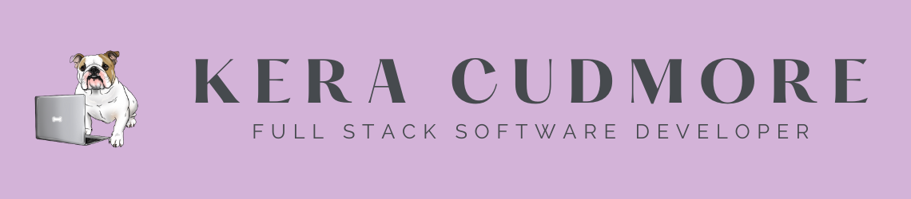
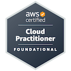
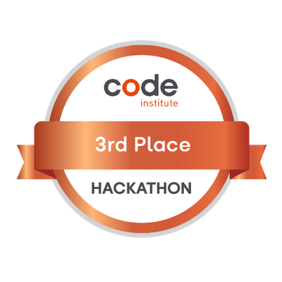
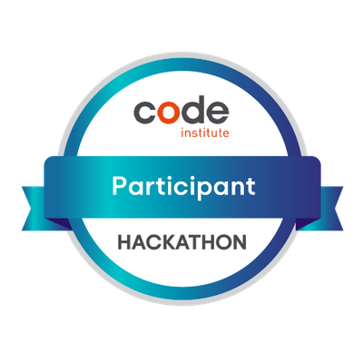
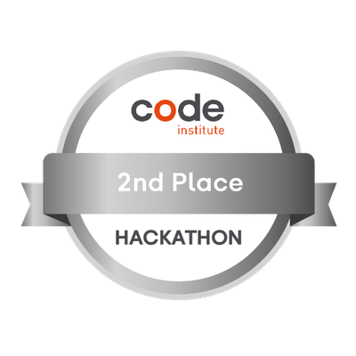
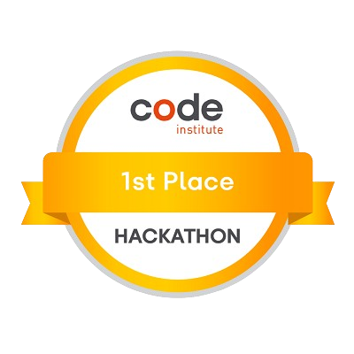
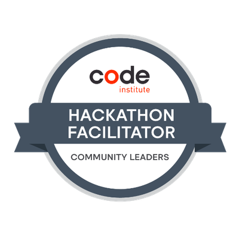
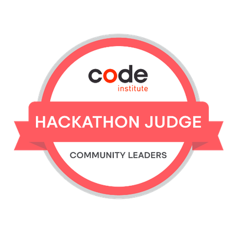
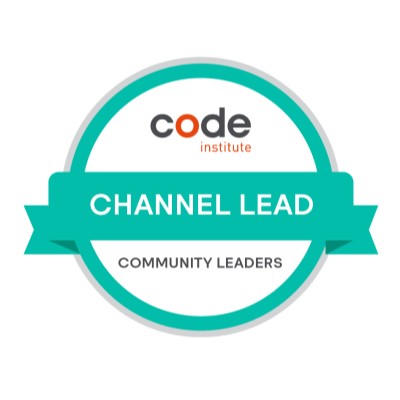
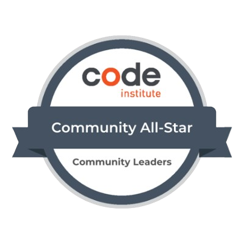

# KERA CUDMORE
## Full Stack Software Developer

### About Me

Hi there I'm Kera, a Junior Software Developer at the Met Office 👋🏻

When I'm not coding, I can be found either reading 📚 (I'm a member of Bully Book Club, an instagram book club for people who love reading & Bulldogs!), quilting and spending time with my family 👨‍👩‍👦.

- - -

### Contact Me

I've also recently started blogging about coding and other related topics, thanks to a writing challenge hosted by Codú. If you'd like to have a look you can find my articles published here:

#### 📰 My Latest Articles

<!-- BLOG-POST-LIST:START -->
- [Linkedin Profile: Recommendations Read full article](https://www.codu.co/articles/linkedin-profile-recommendations-9qedqbja)
- [Linkedin Profile: Projects Read full article](https://www.codu.co/articles/linkedin-profile-projects-n6uqd_6j)
- [Podcasts for Django Developers Read full article](https://www.codu.co/articles/podcasts-for-django-developers-gxfqranh)
- [Create sub-issues in GitHub issues Read full article](https://www.codu.co/articles/create-sub-issues-in-github-issues-mkxdx647)
- [How to add budget alerts to your AWS account Read full article](https://www.codu.co/articles/how-to-add-budget-alerts-to-your-aws-account-iducin-r)
<!-- BLOG-POST-LIST:END -->

---

### AWS Certifications

---

### Hackathon Projects

I signed up for my first hackathon within weeks of starting my diploma, and it was the best thing I've ever done! I love collaborating with others to produce a project within a deadline using sprints, it has also allowed me to develop agile development skills.

<strong>February 2023:</strong> Joined the Hackteam who plan, organise and facilitate the hackathons in collaboration with the Code Institute.

View a summary of my Hackathon Projects

| Date, Theme & Organiser   | Hackathon Project | Place |
| :--------: | :-----------: | :--------------: |
| 
May 2024:

Code Wars: The Hackathon Strikes Back

Organised by the Code Institute
 | 

The Darth Side - The Ultimate fan page dedicated to Darth Vader, the iconic Sith Lord from Star Wars. Explore his history and take a quiz to find out if you have what it takes to join The Darth Side!
 |  |
| 
December 2023:

Secret Santa: A Holiday Hackathon

Organised by the Code Institute
 | 

Seasoned Greetings - Find a tried and true recipe, or give something new a taste this holiday season!
 |  |
| 
May 2023:

May the 4th Be With You.

Organised by the Code Institute.
 | 

This is the Way - Help Grogu find his way back to Mando!
 |  |
| 
May 2022:

Getting Connected Hackathon.

Organised by the Code Institute & Soda Social.
 | 

Found in Translation - Find your tribe, lose the language barrier!
|  |
| 
April 2022:

Earth Day 2022 Hackathon.

Organised by the Code Institute.

<em>Team Scrum Master</em>
 | 

Charity Earth: Tell us what you value - The fun way to discover new environmental charities!
 |  |
| 
February 2022:

Love is in the Air.

Organised by the Code Institute.
 | 

Valentime: Spend more time creating memories!
 |  |
| 
January 2022:

Accelerating the future of workforce well-being and mindfulness.

Organised by the Code Institute & Soda social.
 | 

Empower
 |  |
| 
November 2021:

Breast Cancer Awareness by Women in Tech.

Organised by the Code Institute & IT Labs
| 

Bust It! Cancer without Borders |  |

---

### Code Institute Diploma

**Overall Diploma Grade:** [Distinction](https://www.linkedin.com/in/keracudmore/overlay/education/769538001/multiple-media-viewer/?profileId=ACoAADfAcbgB85Z7ikekUTCZg3iLHHzQUCQYXng&treasuryMediaId=1635520854633)

Click here to view a summary of my Milestone Projects

| Milestone No.   | Project | Description | Grade | 
| :-----------: | :-----------: | :-----------: | :-----------: |
| 1 | 

Bully Book Club
 | 
A website created for Bully Book Club, an instagram book club who review a book with their bulldogs once a month. Created using HTML, CSS and Bootstrap. | Distinction |
| 2 | 

The Quiz Arms
 | 
The Quiz Arms is a pub quiz you can take part in any time, anywhere and test your general knowledge! Created with HTML, CSS, JavaScript & jQuery. | Distinction |
| 3 | 

BookWorm
 | 
BookWorm: a site for bibliophiles! Created with HTML, CSS, JavaScript, Python, Flask. This site combines a relational DB (elephantSQL) & a non-relational DB (mongoDB) and utilises the Google Books API.
 | Distinction |
| 4 | 

Seaside Sewing
 | 
Seaside Sewing: The first port of call for all your sewing needs! A full-stack e-commerce site built with django and stripe payments. This site utilises HTML, CSS, JavaScript, Python. Uses a relational DB (elephantSQL) and Amazon AWS S3.
 | Distinction |
||
| Channel Lead |  | This award is in recognition for participating as a Channel Lead for a relevant Project channel, supporting and improving the student experience of the Code Institute's Diploma in Full Stack Software Development. |Earning Criteria:  1. Hosted a minimum of 2 webinars on various programming topics. 2. Completed a minimum of a 6 week term as a Channel Lead in good standing. 3. Has remained engaged with members of the Community. 4. Has made a considerable positive impact on student learning experiences. | This award is in recognition for participating as a Channel Lead for a relevant Project channel, supporting and improving the student experience of the Code Institute's Diploma in Full Stack Software Development. |
| Community All-Star |  | The Community All-Star badge is awarded to students and alumni of the Code Institute who have notably contributed to our community. This badge recognizes those who have generously given their time to assist and guide others, sharing knowledge and providing support. It celebrates individuals who are actively involved in our community, helping to create a welcoming, collaborative environment. Their efforts in mentoring, answering questions, and participating in community discussions make a significant difference. | This badge is a token of appreciation for their valuable contributions and commitment to the Code Institute community. |

---

### Stats

 

---

 

